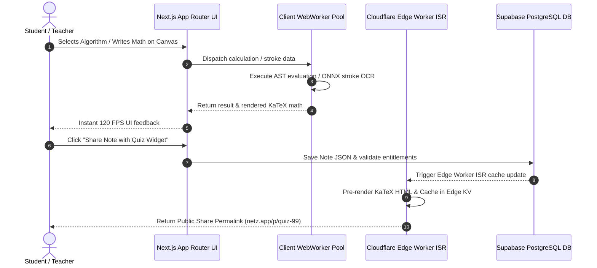

# NETZ - Entire Platform Master Product & Technical Blueprint

> **Executive Single Source of Truth (SSOT)**  
> This master document defines the complete product vision, full module ecosystem, monetization strategy, technical architecture, hosting topology, dynamic caching infrastructure, and deep engineering solutions for **NETZ**—the finished, end-to-end **Interactive Math, Algorithm, Scientific & Engineering Operating System**.

---

## Table of Contents
1. [Executive Vision & Entire Product Ecosystem](#1-executive-vision--entire-product-ecosystem)
2. [Deep Dive: The 5 Core Product Modules](#2-deep-dive-the-5-core-product-modules)
3. [Full-Platform Monetization & Business Economics](#3-full-platform-monetization--business-economics)
4. [Unified Technical Architecture & Tech Stack](#4-unified-technical-architecture--tech-stack)
5. [Ultra-Low-Cost Infrastructure & Hosting Topology](#5-ultra-low-cost-infrastructure--hosting-topology)
6. [Dynamic Node Routing, Caching & Performance Engine](#6-dynamic-node-routing-caching--performance-engine)
7. [Deep Engineering Pitfalls, Hidden Challenges & Solutions](#7-deep-engineering-pitfalls-hidden-challenges--solutions)
8. [End-to-End Execution Sequence & System Data Flow](#8-end-to-end-execution-sequence--system-data-flow)
9. [Implementation Roadmap & Milestones](#9-implementation-roadmap--milestones)

---

## 1. Executive Vision & Entire Product Ecosystem

### What NETZ Is
**NETZ** is an all-in-one **Interactive Math, Algorithm & Engineering Operating System**. It replaces fragmented tools (calculators, note-taking apps, visualizers, quiz platforms, and whiteboards) with a single, highly integrated web ecosystem:

```
┌───────────────────────────────────────────────────────────────────────────────────────────┐
│                                     NETZ UNIFIED OS                                       │
├───────────────┬───────────────┬───────────────┬───────────────┬───────────────────────────┤
│   MODULE A    │   MODULE B    │   MODULE C    │   MODULE D    │         MODULE E          │
│  ALGORITHM    │ NOTION NOTES  │  SMART CANVAS │ GAMIFICATION  │     AI TUTOR & SOLVER     │
│   SOLVERS     │ & QUIZ BANK   │  & PLAYGROUND │ & COMMUNITY   │ (Step-by-Step AI Helper)  │
└───────────────┴───────────────┴───────────────┴───────────────┴───────────────────────────┘
```

---

## 2. Deep Dive: The 5 Core Product Modules

### Module A: Interactive Algorithm Suite & Step-by-Step Solvers
Located under `src/app/(pages.algorithems)/`, this module provides interactive numerical, mathematical, and computer science algorithm visualizers divided into core academic units:

* **Unit 1: Roots of Equations & Numerical Methods**:
  * Bisection Method, Newton-Raphson Method, Regula-Falsi (False Position), Secant Method, Fixed-Point Iteration.
  * Interactive step-by-step iteration tables, error convergence graphs ($\epsilon_a$), tolerance controls, and live plot rendering.
* **Unit 2: Interpolation & Curve Fitting**:
  * Newton Forward/Backward Difference, Lagrange Interpolation, Divided Difference, Least-Squares Linear & Polynomial Regression.
* **Unit 3: Numerical Differentiation & Integration**:
  * Trapezoidal Rule, Simpson’s 1/3 & 3/8 Rules, Gauss Quadrature, Derivative Approximation.
* **Unit 4: Linear Algebra & Matrix Solvers**:
  * Gauss Elimination, Gauss-Jordan Elimination, LU Decomposition, Jacobi & Gauss-Seidel Iterative Solvers, Matrix Inversion, Determinant & Eigenvalues.
* **Unit 5: Differential Equations & Optimization**:
  * Euler’s Method, Modified Euler, Runge-Kutta 2nd & 4th Order (RK4), Differential Equation Curve Plotting.
* **Export Code Generator**: 1-click code export generating clean, executable code snippets in **Python (NumPy/SciPy)**, **C++**, **MATLAB**, and **JavaScript** for any algorithm run.

---

### Module B: Notion-Style Block Workspace & Quiz Bank
Located under `src/app/(Primary.pages)/Notes/`, this module is a rich block-based workspace tailored for STEM notes and study sets:

* **STEM Block Types**:
  * Standard Markdown Text & Headings.
  * KaTeX Formula Blocks ($$ \int_a^b f(x) dx $$) with live preview.
  * Embedded Algorithm Solvers & Dynamic Function Plotters.
  * **Ink Drawing Blocks**: Embedded vector sketches from the whiteboard.
  * **Interactive `QuizBlock` Widgets**: Embedded multiple-choice, numerical range, and step-by-step questions.
* **Notion-Style Hierarchy**: Folder trees, tags, bi-directional note linking, table of contents, and instant search.
* **Academic PDF & Vector SVG Export Engine**: Converts block notes into clean, un-watermarked academic PDF lab reports or vector SVG diagrams for publishing.

---

### Module C: Cross-Platform Smart Whiteboard & CAS Playground
Located under `src/app/(Primary.pages)/Playground/`, this centerpiece module provides a hardware-accelerated infinite math canvas:

* **Cross-Platform Stylus & Touch Support**: Butter-smooth inking at 60–120 FPS across iPad Apple Pencil, Android tablets, Windows convertibles, Chromebooks, and digital smartboards.
* **Hybrid 3-Layer Ink-to-LaTeX & Ink-to-Text OCR**:
  * Layer 1: Sub-20ms gesture parser (`=`, erase, circle-select).
  * Layer 2: Quantized INT8 ONNX Runtime Web model running locally inside WebWorkers ($0 API cost) for stroke-to-LaTeX recognition.
  * Layer 3: Cloud Vision API fallback for complex multi-line matrix calculus.
* **Live Handwritten Math Auto-Evaluation**: Writing `24 * 5 =` or `\frac{d}{dx}(x^3)=` automatically evaluates expressions in background WebWorkers and renders answers adjacent to the `=` sign in matching handwriting or KaTeX fonts.
* **Apple Math Notes Parity + Symbolic CAS Superiority**:
  * Bidirectional **Equation $\leftrightarrow$ Graph Smart Mapping**.
  * **Freehand Curve Fitting**: Reverse-engineers hand-drawn parabolic or sinusoidal sketches into mathematical equations.

---

### Module D: Gamification, Community & Social Feed
Located across `src/app/(Primary.pages)/Profile/` and `src/app/(Primary.pages)/Home/`:

* **LeetCode-Style Gamification**:
  * **Daily Streaks (🔥)**: Streak counters rewarding consistent daily learning and quiz solving.
  * **XP & Leveling System**: Earn XP points for completing algorithm visualizers, solving quizzes, and publishing helpful public notes.
  * **Badges & Achievements**: Unlock achievement badges (e.g. *"Numerical Wizard"*, *"Matrix Master"*).
* **Community Note & Quiz Feed**:
  * Global feed where teachers and students share public study notes and quiz banks.
  * Global keyword indexing (FlexSearch/Fuse.js) for instant search across thousands of public notes.
* **Viral Classroom Referral Loop**: Teachers create notes containing `QuizBlock` widgets and share permalinks (`netz.app/p/calc-101`) with entire classrooms, driving peer discovery.

---

### Module E: AI Tutor & Multimodal Homework Assistant
Integrated seamlessly into Notes, Playground, and Algorithm pages:

* **Step-by-Step AI Problem Solver**: Breaks down complex calculus, linear algebra, or physics problems into easy-to-understand explanations.
* **Photo OCR Problem Scanner**: Snap a picture of a textbook problem to instantly import it into Notes or Playground with solution steps.
* **Interactive AI Chat Sidebar**: Ask questions about any algorithm, note block, or equation directly within the workflow.

---

## 3. Full-Platform Monetization & Business Economics

### Comprehensive Entitlement Matrix Across All Modules

NETZ operates on a sustainable freemium model:

| Feature / Entitlement | Free Tier ($0) | Pro Monthly ($1.99 / mo) | Pro Yearly ($12.99 / yr) | Lifetime Access ($49.99) |
| :--- | :--- | :--- | :--- | :--- |
| **Interactive Algorithm Solvers** | Unlimited Access | Unlimited Access | Unlimited Access | Unlimited Access |
| **Local Whiteboards & Notes** | Unlimited | Unlimited | Unlimited | Unlimited |
| **Public Cloud Shared Notes** | Max 2 Public Links | Max 15 Public Links | Max 60 Public Links | Unlimited Public Links |
| **Handwriting OCR Engine** | 5 conversions / day | **Unlimited** | **Unlimited** | **Unlimited** |
| **Quiz Creation & Embedding** | Take & Practice Only | **Create & Embed Quizzes** | **Create & Embed Quizzes** | **Create & Embed Quizzes** |
| **Ad Experience** | Smart Navigation Ads | **100% Ad-Free** | **100% Ad-Free** | **100% Ad-Free** |
| **Export Formats** | Standard PNG | **Vector SVG, Clean PDF, LaTeX** | **Vector SVG, Clean PDF, LaTeX** | **Vector SVG, Clean PDF, LaTeX** |
| **AI Homework Helper** | 3 AI queries / day | **100 AI queries / day** | **Unlimited Priority AI** | **Unlimited Priority AI** |
| **Cloud Sync & Backup** | Standard Sync | **Priority Real-Time Sync** | **Priority Real-Time Sync** | **Priority Real-Time Sync** |

### Smart Navigation-Based Ad Engine
To protect student concentration and whiteboard strokes:
* **Zero Mid-Stroke Ads**: Ads are never triggered during active drawing, math solving, or reading.
* **Navigation Trigger Counter**: Interstitial ads trigger only during page moves (e.g. moving from an Algorithm solver page to Notes) after **4 page transitions** for Free Tier users.

### Entire Platform Operating Unit Economics (>98.5% Gross Margin)
Because 95% of math AST parsing, numerical algorithms, graph plotting, and basic stroke OCR execute locally in the browser:

```
[For 10,000 Active Monthly Users (1,000 Pro Subscribers = $1,990 / month Gross Revenue)]:
- Database Storage (10,000 public notes @ 15 KB avg): ~150 MB total DB storage.
- Bandwidth (200k note reads & algorithm visits): ~4.5 GB total bandwidth.
- Server API, Auth & Edge Compute (Supabase Pro + Cloudflare Workers): ~$25.00 / month.
- AI & Cloud OCR API Usage (Gated Cloud Fallback): ~$15.00 / month.
- Net Gross Profit: $1,950.00 / month (98.0% Profit Margin).
```

---

## 4. Unified Technical Architecture & Tech Stack

```
                              [NETZ CLIENT BROWSER / PWA LAYER]
                                             │
      ┌──────────────────────────────────────┼──────────────────────────────────────┐
      ▼                                      ▼                                      ▼
[Next.js App Router UI]           [Client Math & Worker Engines]        [Zustand & Dexie State]
 ├─ React Server Components (RSC)  ├─ WebWorker Math.js / Nerdamer AST   ├─ Zustand (UI & entitilements)
 ├─ KaTeX Formula Engine          ├─ ONNX Runtime Web INT8 (Local OCR)  ├─ Dexie.js (IndexedDB Offline DB)
 ├─ Chart.js / Dynamic Canvas     ├─ Numerical Algorithm Solvers        ├─ TanStack Query v5 (Server Sync)
 └─ Vanilla CSS + Tailwind        └─ FlexSearch Client Search Index     └─ React Hook Form + Zod
                                             │
                                             ▼
                              [HYBRID BACKEND INFRASTRUCTURE]
                                             │
      ┌──────────────────────────────────────┼──────────────────────────────────────┐
      ▼                                      ▼                                      ▼
[Cloudflare Edge Workers]          [Supabase Postgres DB]                [Cloudflare R2 Object Storage]
 ├─ Public Node ISR Routing       ├─ User Accounts & Entitlements       ├─ Vector SVG Exports & Media
 ├─ Pre-rendered KaTeX Server Math ├─ Public Notes JSON & Quizzes        ├─ Shared Ink Drawing Snapshots
 └─ Rate Limiting & Auth Validation └─ Row Level Security (RLS) Policy    └─ Zero Egress Bandwidth Cost
```

### Complete Store Architecture (Zustand + TanStack Query v5)

* **Client Stores (`src/app/store/`)**:
  * `useAuthStore.js`: Session tokens, user profile data.
  * `useSubscriptionStore.js`: Plan entitlements, nav counter for ads.
  * `useGamificationStore.js`: Streaks, XP, level badges.
  * `useQuizEngineStore.js`: Active quiz state, timer countdowns.
  * `useCanvasStore.js`: Whiteboard tool selection, stroke state, zoom/pan.
  * `useUIStore.js`: Sidebar toggle, theme settings, modals.
* **Server State Hooks (`src/app/hooks/api/`)**:
  * `useUserQueries.js`, `useNoteQueries.js`, `useQuizQueries.js` powered by **TanStack Query v5** with optimistic UI updates.

---

## 5. Ultra-Low-Cost Infrastructure & Hosting Topology

```
                            NETZ ULTRA-LOW-COST DEPLOYMENT
                            
  ┌───────────────────────┐      ┌───────────────────────┐      ┌───────────────────────┐
  │   Cloudflare Pages    │      │  Supabase Postgres DB │      │  Cloudflare R2 Bucket │
  │   (Next.js App Edge)  │─────►│ (User & Public Data)  │─────►│  (SVG & Image Assets) │
  │   Cost: $0.00 / mo    │      │  Cost: $0.00 - $25/mo │      │  Cost: $0.00 / mo     │
  └───────────────────────┘      └───────────────────────┘      └───────────────────────┘
```

| Infrastructure Layer | Provider & Tier | Monthly Cost (0–10k Users) | Monthly Cost (100k+ Users) | Key Advantage |
| :--- | :--- | :--- | :--- | :--- |
| **Frontend & Edge SSR** | Cloudflare Pages / Vercel | **$0.00** | **$20.00** | Global Edge network, unlimited bandwidth. |
| **Database & Auth** | Supabase (Free $\rightarrow$ Pro) | **$0.00** | **$25.00** | PostgreSQL DB, Auth, RLS security. |
| **Edge Cache & KV** | Upstash Redis (Serverless) | **$0.00** | **$10.00** | Ultra-fast rate limiting & token buckets. |
| **Media & Storage** | Cloudflare R2 | **$0.00** | **$5.00** | **$0 bandwidth egress charges**. |
| **AI / OCR Fallback** | Gemini Vision / HuggingFace | **$0.00** | **$15.00** | Pay-as-you-go gated cloud vision endpoint. |
| **TOTAL FIXED COST** | — | **$0.00 / mo** | **~$75.00 / mo** | Fully profitable on under 40 Pro subscribers! |

---

## 6. Dynamic Node Routing, Caching & Performance Engine

### 1. Dynamic Public Page Nodes (`netz.app/p/[nodeId]`)
Public note permalinks are pre-rendered on Cloudflare Edge Workers:
- **Server-Side KaTeX Stringification**: Converts LaTeX (`\int x^2 dx`) directly into clean HTML tags using `katex.renderToString()`. End-users receive static HTML with zero math rendering delay or layout shifts (CLS).
- **Incremental Static Regeneration (ISR)**: Cached via HTTP headers (`Cache-Control: public, max-age=3600, s-maxage=31536000, stale-while-revalidate=86400`). Served directly from global CDN caches in under 15ms.

### 2. Algorithm Page Pre-Rendering (`netz.app/algorithms/[unit]/[method]`)
All algorithm visualizer pages are pre-built static pages (SSG). The UI loads instantly, and interactive calculations execute locally in client JavaScript/WASM upon user input.

### 3. Dynamic Graph Node Topology Executor
For interconnected smart blocks (Equation $\leftrightarrow$ Graph $\leftrightarrow$ Quiz), dependencies are evaluated using **Topological Sort (Kahn's Algorithm)**:

```javascript
// Dynamic Node Graph Topological Executor
export function evaluateGraphTopology(nodes, edges) {
  const inDegree = new Map();
  const adjList = new Map();
  
  nodes.forEach(node => {
    inDegree.set(node.id, 0);
    adjList.set(node.id, []);
  });
  
  edges.forEach(({ from, to }) => {
    adjList.get(from).push(to);
    inDegree.set(to, inDegree.get(to) + 1);
  });
  
  const queue = nodes.filter(n => inDegree.get(n.id) === 0).map(n => n.id);
  const executionOrder = [];
  
  while (queue.length > 0) {
    const current = queue.shift();
    executionOrder.push(current);
    
    (adjList.get(current) || []).forEach(neighbor => {
      inDegree.set(neighbor, inDegree.get(neighbor) - 1);
      if (inDegree.get(neighbor) === 0) queue.push(neighbor);
    });
  }
  
  if (executionOrder.length !== nodes.length) {
    throw new Error('Cyclic dependency detected in node graph!');
  }
  
  return executionOrder;
}
```

---

## 7. Deep Engineering Pitfalls, Hidden Challenges & Solutions

### Challenge 1: Heavy Algorithm Computation Freezing the Main UI Thread
- **The Problem**: Solving a high-order differential equation or $50 \times 50$ matrix inversion directly in the React main thread locks the browser UI, causing button freezes and input lag.
- **Solution**: Offload all numerical method iterations, matrix inversions, and expression parsing into a dedicated **WebWorker Worker Pool**. If a calculation exceeds a 200ms threshold, a watchdog timer terminates the worker cleanly without crashing the tab.

### Challenge 2: Infinite Canvas Memory & FPS Scaling
- **The Problem**: Drawing thousands of strokes on an infinite canvas causes memory consumption to soar, dropping frame rates from 120 FPS to 15 FPS on mobile browsers.
- **Solution**: Use **R-Tree spatial indexing (`rbush`)** to filter and render *only visible strokes* within the current viewport, paired with offscreen tiled bitmap canvas baking for finished strokes.

### Challenge 3: Gamification Cheat Prevention (XP & Streaks)
- **The Problem**: Malicious users sending fake API requests to claim infinite XP or forge daily streaks.
- **Solution**: Compute and validate XP awards server-side using Supabase PostgreSQL Database Functions (`RPC`) with cryptographic hash signatures. Free-tier request rates are strictly rate-limited via Upstash Redis.

### Challenge 4: Offline-to-Cloud Notes Sync Conflicts
- **The Problem**: Editing notes on an iPad offline while modifying the same note on a laptop causes data loss upon reconnecting.
- **Solution**: **Dexie IndexedDB local-first architecture** combined with **Delta CRDTs (Conflict-Free Replicated Data Types)**. Edits append vector clocks, preserving both versions with a visual merge prompt upon reconnecting.

### Challenge 5: Cloud AI & OCR API Cost Spikes
- **The Problem**: Unchecked AI study queries or cloud handwriting OCR requests could result in massive API bill spikes.
- **Solution**: **Hybrid 3-Layer Pipeline** (Layer 1 geometry parser, Layer 2 local ONNX WebWorker model) handles 90% of requests locally for **$0 API cost**. Gated Layer 3 cloud fallback enforces strict token bucket rate limits per user plan.

### Challenge 6: KaTeX Layout Shifts (CLS) across Notes & Algorithms
- **The Problem**: Un-rendered math code (`\frac{a}{b}`) displaying as plain text before JS hydration triggers jarring page jumps.
- **Solution**: Pre-render KaTeX math strings into static HTML on the server/edge, paired with pre-loaded WOFF2 math fonts in `<head>`.

### Challenge 7: Multi-Device Palm Rejection & Pointer Discrepancies
- **The Problem**: Browsers handle touch vs pen events inconsistently (e.g. iPad Safari vs Android Chrome), leading to accidental palm drawing.
- **Solution**: Hardware pointer normalization isolating `pointerType === 'pen'` from touch gestures, combined with contact surface area filtering (`width > 25px && height > 25px`).

---

## 8. End-to-End Execution Sequence & System Data Flow



---

## 9. Implementation Roadmap & Milestones

- [x] **Architecture Specification**: Complete Master Blueprint for Entire NETZ Ecosystem (`NETZ_MASTER_PRODUCT_AND_TECHNICAL_BLUEPRINT.md`).
- [ ] **Phase 1: State & Provider Layer**: Set up Zustand store slices (`useAuthStore`, `useSubscriptionStore`, `useGamificationStore`, `useQuizEngineStore`, `useCanvasStore`) and TanStack Query v5 providers.
- [ ] **Phase 2: Touch Whiteboard & CAS Engine**: Build hardware-normalized Pointer Canvas API with Catmull-Rom smoothing, R-Tree spatial indexing, and WebWorker AST evaluator.
- [ ] **Phase 3: Notion-Style Workspace & Quiz Block**: Build block editor with embedded `QuizBlock` widgets and academic PDF export engine.
- [ ] **Phase 4: Algorithm Suite Optimization**: Refactor numerical method visualizers to execute inside WebWorkers with step-by-step code export generation.
- [ ] **Phase 5: Gamification & Public Feed**: Connect daily streaks (🔥), XP leaderboard, public note cloud sync, and search index.
- [ ] **Phase 6: Monetization & Edge Deployment**: Integrate Stripe checkout, smart navigation ad tracker, and deploy to Cloudflare Pages & Supabase.
