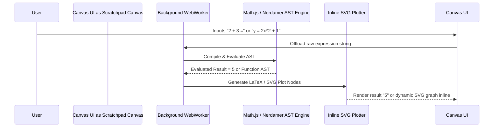

# NETZ v2 - Implementation Plan & Technical Architecture Specification

This document details the complete technical architecture, monetization strategy, and implementation roadmap for **NETZ v2**.

---

## 1. Executive Summary & Tiered Monetization Strategy

**NETZ v2** transforms the platform into an all-in-one **Interactive Math & Engineering OS**, combining numerical methods, statistical hypothesis testing, a Notion-style collaborative notes workspace, clean SVG vector exports, and a zero-API-cost client-side Apple Math Notes playground.

### Subscription & Pricing Tiers

| Tier | Price | Features Included |
| :--- | :--- | :--- |
| **Free Tier** | **$0** | Full calculator access, ad-supported with smart navigation frequency capping (ad triggers every 3–5 page transitions), standard PNG exports, public community notes search. |
| **Pro Monthly** | **$1.99 / month** | 100% ad-free, crisp vector SVG & high-resolution PDF exports, Notion-style notes workspace, client-side Apple Math Notes playground. |
| **Pro Yearly** | **$12.99 / year** *(Recommended)* | All Pro features at a ~45% discount compared to monthly. |
| **Lifetime Access** | **$49.99 one-time** | Perpetual Pro tier access forever with priority sync. |

---

## 2. Smart Navigation-Based Ad Frequency Control

To maximize ad revenue without annoying users mid-calculation, NETZ v2 replaces static 30-second timers with **Navigation Page Transition Counters**:

```javascript
// Smart Navigation Counter Hook (src/app/hooks/useAdNavigationTracker.js)
export function useAdNavigationTracker(userTier) {
  const registerPageTransition = () => {
    if (userTier !== 'FREE') return;
    
    const count = parseInt(sessionStorage.getItem('netz_nav_count') || '0', 10) + 1;
    sessionStorage.setItem('netz_nav_count', count.toString());
    
    // Trigger interstitial ad after 3 to 5 algorithm page moves
    if (count >= 4) {
      triggerInterstitialAd();
      sessionStorage.setItem('netz_nav_count', '0');
    }
  };

  return { registerPageTransition };
}
```

---

## 3. Apple Math Notes / Calculator Playground (Zero API Cost)

The Apple Math Notes / Calculator scratchpad operates **100% client-side** using `Math.js`, `Nerdamer`, and background `WebWorkers`. This delivers instantaneous calculation and graphing with **zero server/LLM API costs**.



### Key Highlights:
1. **Live Expression Auto-Evaluation**: Typing `2 + 3 =` immediately computes and appends `5`.
2. **Auto-Graphing Engine**: Typing `y = f(x)` or `f(x) = ...` automatically appends a responsive SVG graph inline beneath the expression line.
3. **PWA Offline Execution**: Functions 100% offline without needing internet access.

---

## 4. Notion-Style Collaborative Notes Workspace

Located in `src/app/(Primary.pages)/Notes/page.js`, this workspace replaces simple text boxes with a rich block-based editor.

* **Block Types**: Headings, formatted text, LaTeX equations (`$$ \int f(x) dx $$`), embedded live calculator widgets, and interactive graphs.
* **Visibility & Sharing**:
  * **Private Notes**: Encrypted local PWA storage with optional cloud backup.
  * **Public Notes**: Generates unique shareable keys or publishes to the **Global Community Notes Feed**.
* **Global Keyword Search**: Client-side indexing (FlexSearch / Fuse.js) enabling fast search across all public community notes.

---

## 5. High-Precision Vector SVG & PDF Export Pipeline

Upgrades `src/app/utils/ExportToPNG.js` into a comprehensive export suite:

1. **Scalable Vector Graphics (.svg)**: Direct extraction of clean vector SVG nodes from math charts and KaTeX formulas.
2. **Clean PDF Lab Reports**: High-resolution, un-watermarked academic PDF export powered by `jspdf` for Pro tier subscribers.

---

## 6. Implementation Roadmap & Milestones

### Phase 1: Core Engine & Export Extensions
* [ ] Build `useAdNavigationTracker` hook for navigation-based ad triggers.
* [ ] Upgrade `ExportToPNG.js` to support `.svg` vector downloads.

### Phase 2: Workspace & Community Notes
* [ ] Implement block-based Notion-style editor in `src/app/(Primary.pages)/Notes/page.js`.
* [ ] Build public/private note sharing toggle and global keyword search index.

### Phase 3: Apple Math Notes & Tiering
* [ ] Build WebWorker-powered client-side scratchpad in `src/app/(Primary.pages)/Playground/page.js`.
* [ ] Integrate subscription billing (Stripe / Razorpay) for $1.99/mo, $12.99/yr, and $49.99 lifetime access.
