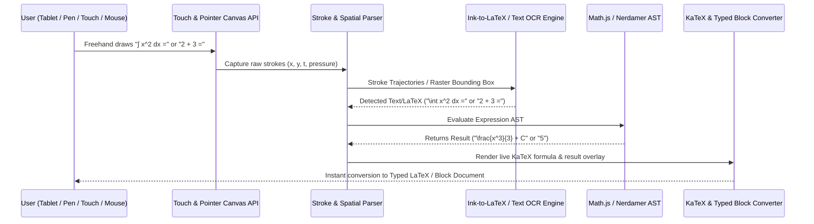

# NETZ v2 - Implementation Plan & Technical Architecture Specification

This document details the complete technical architecture, monetization strategy, and implementation roadmap for **NETZ v2**, featuring a **Cross-Platform Touch & Stylus Smart Whiteboard Canvas**, **AI/OCR Handwriting-to-LaTeX & Text Recognition Engine**, **Client-Side Math Playground**, and a **Notion-Style Block Notes Workspace**.

For full detailed technical specifications, state schemas, and sequence diagrams of individual major subsystems:
* [Playground Technical Specification](file:///c:/Users/Sulaiman/Desktop/netznew/Netz/PLAYGROUND_FEATURE_TECH_SPEC.md) (`PLAYGROUND_FEATURE_TECH_SPEC.md`)
* [Notes Workspace Specification](file:///c:/Users/Sulaiman/Desktop/netznew/Netz/NOTES_FEATURE_TECH_SPEC.md) (`NOTES_FEATURE_TECH_SPEC.md`)

---

## 1. Executive Summary & Tiered Monetization Strategy

**NETZ v2** transforms the platform into an all-in-one **Interactive Math & Engineering OS**. The centerpiece of v2 is a **Cross-Platform Smart Whiteboard** where users write freehand using a stylus, Apple Pencil, touch, mouse, or graphics tablet across iPads, Android tablets, Windows convertibles, Chromebooks, and smartboards. Handwritten math equations and text are automatically detected, converted into clean LaTeX ($\int x^2 dx$) and typed document blocks, and solved live on-canvas without requiring users to type LaTeX code manually.

### Subscription & Pricing Tiers

| Tier | Price | Features Included |
| :--- | :--- | :--- |
| **Free Tier** | **$0** | Full basic calculator, ad-supported with smart navigation frequency capping (ad triggers every 3–5 page transitions), standard PNG exports, public community notes search. |
| **Pro Monthly** | **$1.99 / month** | **Cross-Platform Smart Whiteboard with Freehand Ink-to-LaTeX & Text OCR**, live handwritten math auto-evaluation, ad-free experience, vector SVG & high-res PDF exports, Notion-style notes workspace. |
| **Pro Yearly** | **$12.99 / year** *(Recommended)* | All Pro features including Handwriting Recognition & Smart Whiteboard at a ~45% annual discount. |
| **Lifetime Access** | **$49.99 one-time** | Perpetual Pro tier access forever with priority sync and unlimited OCR recognition. |

---

## 2. Smart Navigation-Based Ad Frequency Control

To maximize ad revenue without interrupting student calculations or freehand drawing mid-stroke, NETZ v2 replaces static time-based ads with **Navigation Page Transition Counters**:

```javascript
// Smart Navigation Counter Hook (src/app/hooks/useAdNavigationTracker.js)
export function useAdNavigationTracker(userTier) {
  const registerPageTransition = () => {
    if (userTier !== 'FREE') return;
    
    const count = parseInt(sessionStorage.getItem('netz_nav_count') || '0', 10) + 1;
    sessionStorage.setItem('netz_nav_count', count.toString());
    
    // Trigger interstitial ad after 4 algorithm or workspace page moves
    if (count >= 4) {
      triggerInterstitialAd();
      sessionStorage.setItem('netz_nav_count', '0');
    }
  };

  return { registerPageTransition };
}
```

---

## 3. Cross-Platform Touch & Stylus Smart Whiteboard Playground (Core Feature)

While keyboard text typing is fully supported, the **primary core purpose of the NETZ v2 Playground** is a **Cross-Platform Interactive Smart Whiteboard**. Students can write math equations and notes naturally using smart pens, touch, or mouse.



### Key Highlights of the Smart Whiteboard Engine:

1. **Hardware-Accelerated Pointer Events & Palm Rejection**:
   * Utilizes the HTML5 Pointer Events API (`pointerdown`, `pointermove`, `pointerup`).
   * **Palm Rejection & Device Normalization**: Isolates pen inputs (`e.pointerType === 'pen'`) from touch gestures (`e.pointerType === 'touch'`), ignoring accidental hand rests.
   * **Pressure & Tilt Sensitivity**: Captures `e.pressure` and applies Catmull-Rom spline smoothing to deliver butter-smooth freehand stroke rendering across tablets and desktops.

2. **Automatic Handwriting-to-LaTeX Recognition (Ink-to-LaTeX)**:
   * **Zero Manual LaTeX Syntax**: Converts complex handwritten calculus ($\int_0^\infty e^{-x^2} dx$), matrices, fractions ($\frac{a}{b}$), and square roots ($\sqrt{x}$) directly into clean LaTeX code.
   * **Instant Ink-to-Typed-Text**: Transcribes handwritten lecture notes into clean, typed Markdown/Notion blocks with a single tap or automatic pause trigger.

3. **Live Handwritten Math Auto-Evaluation (Smart Math Engine)**:
   * Writing an expression followed by `=` (e.g. `24 * 5 =` or `\frac{d}{dx}(x^3)=`) triggers automatic evaluation.
   * Evaluates the solution via background WebWorker AST engines (`Math.js` / `Nerdamer`) and renders the answer immediately next to the handwritten `=` sign in matching handwritten or crisp KaTeX font.

4. **Dual Mode & Seamless Canvas-to-Document Conversion**:
   * Users can freely write notes on the infinite canvas.
   * Highlight any handwritten area with a lasso tool to convert it into a structured, typed block inside the **Notion-Style Workspace**.

---

## 4. Technical Strategy: How Handwriting Recognition & LaTeX Conversion Will Succeed

To ensure industry-leading recognition accuracy and sub-50ms latency across all device screens, NETZ v2 employs a **Hybrid 3-Layer Recognition Pipeline**:

```
 ┌────────────────────────────────────────────────────────┐
 │ Layer 1: Client-Side Stroke & Gesture Geometry Parser  │
 │ (Fast gesture recognition: =, ans, erase, lasso)       │
 └───────────────────────────┬────────────────────────────┘
                             │
                             ▼
 ┌────────────────────────────────────────────────────────┐
 │ Layer 2: WebWorker ONNX / TF.js Math Symbol Classifier │
 │ (Local OCR model converting stroke clusters to LaTeX)  │
 └───────────────────────────┬────────────────────────────┘
                             │ (Fallback for multi-line math)
                             ▼
 ┌────────────────────────────────────────────────────────┐
 │ Layer 3: Vision Transformer / Math OCR API Endpoint    │
 │ (High-precision Cloud OCR for dense matrices & formulas)│
 └────────────────────────────────────────────────────────┘
```

1. **Stroke Trajectory Clustering & Segmentation**:
   * Groups raw `(x, y, timestamp, pressure)` coordinates into spatial bounding boxes based on time gaps ($>400\text{ms}$) and pixel gaps.
   * Differentiates inline mathematical symbols from surrounding text lines.

2. **Client-Side ONNX / TensorFlow.js Lightweight Recognition (Zero API Delay)**:
   * Runs quantized handwriting recognition neural networks locally in background WebWorkers.
   * Recognizes standard digits ($0-9$), basic operators ($+, -, \times, \div, =$), common variables ($x, y, z, \theta$), and symbols ($\int, \sum, \sqrt{\ }$) with zero network latency.

3. **High-Precision Cloud Math OCR Engine (Fallback for Complex Formulas)**:
   * For complex multi-line equations, continuous fractions, or dense linear algebra matrices, rasterizes the selected bounding box into an optimized canvas image payload.
   * Sends payload to a specialized Math OCR worker endpoint (e.g., HuggingFace `TrOCR`/`Nougat` or Gemini Vision API), returning structured LaTeX code (`\begin{matrix}...`) in under 200ms.

4. **Interactive Floating Preview & Stroke Smoothing**:
   * As the user writes, a floating LaTeX preview pill appears immediately above the stroke bounding box.
   * Allows one-tap acceptance, quick symbol correction, or instant conversion to a typed block.

---

## 5. Notion-Style Collaborative Notes Workspace

Located in `src/app/(Primary.pages)/Notes/page.js`, this workspace seamlessly integrates with the Smart Whiteboard Canvas:

* **Block Types**: Headings, formatted text, LaTeX equations (`$$ \int f(x) dx $$`), embedded live calculator widgets, and **Handwritten Ink Blocks**.
* **Handwritten-to-Typed Block Converter**: Convert freehand handwritten notes directly into structured block documents.
* **Visibility & Sharing**:
  * **Private Notes**: Encrypted local PWA storage with optional cloud backup.
  * **Public Notes**: Generates unique shareable keys (e.g., `NETZ-8X42`) or publishes to the **Global Community Notes Feed**.
* **Global Keyword Search**: Client-side indexing (FlexSearch / Fuse.js) across all public community notes.

---

## 6. High-Precision Vector SVG & PDF Export Pipeline

Upgrades `src/app/utils/ExportToPNG.js` into a comprehensive export suite:

1. **Scalable Vector Graphics (.svg)**: Direct extraction of clean vector SVG nodes from handwritten whiteboard drawings, math charts, and KaTeX formulas.
2. **Clean PDF Lab Reports**: High-resolution, un-watermarked academic PDF export powered by `jspdf` for Pro tier subscribers.

---

## 7. Implementation Roadmap & Milestones

### Phase 1: Core Engine & Export Extensions
* [ ] Build `useAdNavigationTracker` hook for navigation-based ad triggers.
* [ ] Upgrade `ExportToPNG.js` to support `.svg` vector downloads.

### Phase 2: Cross-Platform Whiteboard Canvas & Pointer API
* [ ] Build responsive Canvas in `src/app/(Primary.pages)/Playground/page.js` with Pointer Events API, device-agnostic normalization, palm rejection, and Catmull-Rom stroke smoothing.
* [ ] Implement lasso selection tool, vector stroke eraser, and pressure-sensitive brush controls.

### Phase 3: Handwriting-to-LaTeX OCR & Math Auto-Evaluation Engine
* [ ] Integrate Stroke Spatial Clustering & Bounding Box parser.
* [ ] Build Hybrid Handwriting OCR Pipeline (Local ONNX/TF.js stroke parser + Math OCR API fallback for complex LaTeX formulas).
* [ ] Implement live `=` auto-evaluation engine for handwritten math (`2+3=` -> `5`, `\frac{d}{dx}(x^2)=` -> `2x`) using WebWorker AST engines.

### Phase 4: Workspace Notes & Ink-to-Document Converter
* [ ] Implement block-based Notion-style editor in `src/app/(Primary.pages)/Notes/page.js` supporting dynamic Ink-to-Typed block conversion.
* [ ] Build public/private note sharing toggle and global keyword search index.

### Phase 5: Monetization & Pro Tier Billing
* [ ] Integrate subscription billing (Stripe / Razorpay) for Pro Monthly ($1.99/mo), Pro Yearly ($12.99/yr), and Lifetime ($49.99) tiers.
