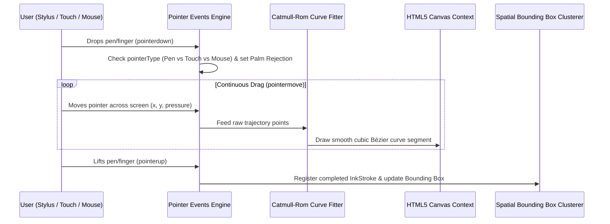
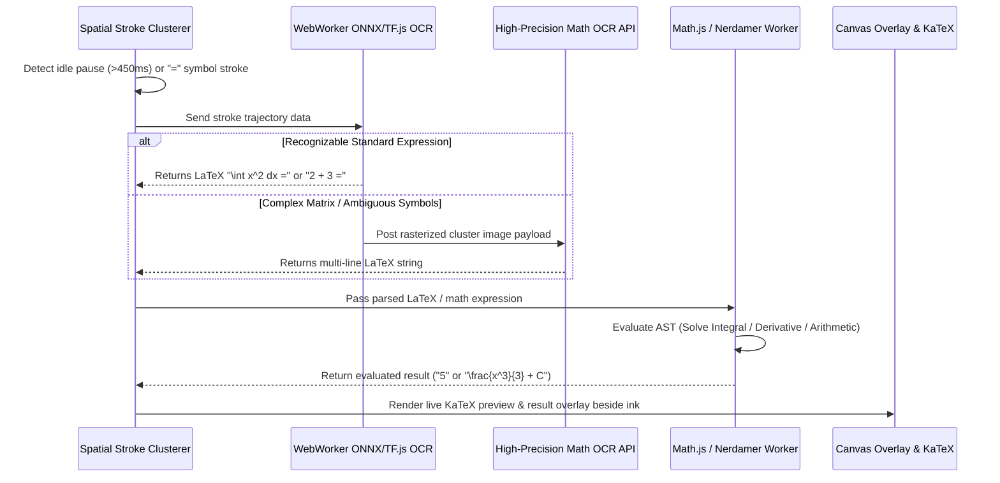

# NETZ Smart Whiteboard & Calculator Playground - Technical Architecture & Specification

## 1. Overview & Vision

The **NETZ Smart Whiteboard & Calculator Playground** (`src/app/(Primary.pages)/Playground/page.js`) is a **cross-platform, touch-and-stylus-optimized interactive math canvas**. Designed for students and engineers across all devices — including iPad (Apple Pencil), Android tablets, Windows convertibles/touchscreens, Chromebooks, desktop browsers (mouse & Wacom graphics tablets), and digital smartboards — it bridges freehand intuitive drawing with real-time **Handwriting-to-LaTeX conversion**, **live mathematical expression evaluation**, and **instant transcription into Notion-style typed block notes**.

---

## 2. Technical Architecture & Tech Stack

```
                                  [NETZ Playground Canvas Architecture]
                                                    │
                 ┌──────────────────────────────────┼──────────────────────────────────┐
                 ▼                                  ▼                                  ▼
      [Pointer & Gesture Engine]          [Hybrid 3-Layer OCR Engine]          [AST Math Solver & KaTeX]
                 │                                  │                                  │
    ┌────────────┴────────────┐        ┌────────────┴────────────┐        ┌────────────┴────────────┐
    ▼                         ▼        ▼                         ▼        ▼                         ▼
HTML5 Pointer Events     Catmull-Rom   Local Gesture &   WebWorker Local   Math.js / Nerdamer AST   KaTeX Render & 
(Pen, Touch, Mouse)    Spline Smoothing Stroke Cluster    ONNX/TF.js OCR    Background Workers      Ink-to-Block Sync
```

### Stack Components:
* **Canvas Rendering Engine**: HTML5 Canvas + SVG overlay for high-frequency vector rendering (60-120 FPS).
* **Cross-Device Input Layer**: HTML5 Pointer Events API (`pointerdown`, `pointermove`, `pointerup`) with device-agnostic input normalization (`pointerType === 'pen' | 'touch' | 'mouse'`), pressure (`e.pressure`), tilt, and hardware palm rejection.
* **Handwriting & Math OCR Pipeline**:
  * **Layer 1 (Local Geometry Parser)**: Instant gesture detection (`=`, `ans`, circle-select, scratch-out erase).
  * **Layer 2 (Client-Side WebWorker OCR)**: Quantized ONNX Runtime Web / TensorFlow.js model running locally for zero-latency stroke-to-symbol recognition ($0-9$, $+$, $-$, $\times$, $\div$, $\int$, $\sum$, $\sqrt{\ }$, variables).
  * **Layer 3 (High-Precision Math OCR API Fallback)**: Rasterized canvas payload sent to lightweight Math OCR transformer endpoint (e.g. HuggingFace `TrOCR`/`Nougat` or Gemini Vision API) for complex multi-line matrix calculus.
* **Live Math Engine**: `Math.js` and `Nerdamer` AST engine running inside WebWorkers for instant expression evaluation without UI main-thread freezing.
* **Math Formula Renderer**: KaTeX (`katex`, `react-katex`) for crisp mathematical rendering.

---

## 3. Data Schema & Canvas State Model

```typescript
// Stroke Trajectory & Point Model
export interface PointerPoint {
  x: number;             // X coordinate in canvas space
  y: number;             // Y coordinate in canvas space
  pressure: number;      // Normalised pressure (0.0 to 1.0)
  timestamp: number;     // Performance timestamp (ms)
}

export interface InkStroke {
  id: string;            // Unique stroke identifier
  color: string;         // Hex color code (e.g. "#3B82F6")
  width: number;         // Base stroke width (px)
  tool: 'pen' | 'highlighter' | 'eraser';
  points: PointerPoint[];// Array of captured stroke points
  bbox: BoundingBox;     // Spatial bounding box { minX, minY, maxX, maxY }
}

export interface BoundingBox {
  minX: number;
  minY: number;
  maxX: number;
  maxY: number;
}

// Bounding Box Stroke Cluster for OCR & Math Solver
export interface StrokeCluster {
  clusterId: string;
  strokeIds: string[];
  bbox: BoundingBox;
  rawTrajectoryData: PointerPoint[][];
  detectedLatex?: string;   // E.g., "\int_0^1 x^2 dx ="
  detectedText?: string;    // E.g., "Velocity of particle"
  evaluatedResult?: string; // E.g., "0.3333" or "\frac{1}{3}"
  status: 'drawing' | 'parsing' | 'evaluated' | 'converted';
}

// Complete Canvas Session Document Schema
export interface PlaygroundCanvasSession {
  sessionId: string;
  title: string;
  createdAt: string;
  updatedAt: string;
  strokes: InkStroke[];
  clusters: StrokeCluster[];
  gridStyle: 'none' | 'grid' | 'dots' | 'lines';
  zoomLevel: number;
  panOffset: { x: number; y: number };
}
```

---

## 4. Architectural Workflows & Data Flows

### A. Freehand Stroke Capture & Spline Interpolation Flow



### B. Hybrid Ink-to-LaTeX Recognition & Math Auto-Evaluation Sequence



### C. Handwriting Recognition Mechanics & Handling Bad / Messy Handwriting

To handle messy, fast, or poorly-formed student handwriting (e.g. distinguishing `I = \alpha = 2 + 3` from ambiguous symbols like `a`, `oc`, `z`, or `t`), the NETZ recognition pipeline employs a 5-step normalization & disambiguation process:

```
┌──────────────────────────┐    ┌──────────────────────────┐    ┌──────────────────────────┐
│ 1. Stroke Normalization  │───>│ 2. Spatial/Time Cluster  │───>│ 3. Dual-Channel Feature  │
│  (Resample, scale, smooth)│    │  (Group strokes into 2D) │    │  (Trajectory + Raster)   │
└──────────────────────────┘    └──────────────────────────┘    └────────────┬─────────────┘
                                                                             │
┌──────────────────────────┐    ┌──────────────────────────┐                 │
│ 5. Math Context Decoder  │<───│ 4. 2D Structural Math    │<────────────────┘
│ (Disambiguate α vs a vs z)│    │  AST Grammar Tree Parser │
└──────────────────────────┘    └──────────────────────────┘
```

1. **Stroke Preprocessing & Resampling (Input Normalization)**:
   * **Equidistant Point Resampling**: Converts raw point coordinates $(x_i, y_i, t_i, p_i)$ into evenly spaced points, removing jitter, fast velocity gaps, and shaky hand artifacts.
   * **Bounding Box Scaling**: Scales symbol bounding boxes to a normalized coordinate space ($128 \times 128$) so small, large, or skewed handwriting is recognized uniformly.
   * **Catmull-Rom Smoothing**: Filters high-frequency hand tremors while preserving sharp corners needed for symbols like $+$, $-$, $\alpha$, and digits.

2. **Spatial & Temporal Bounding Box Clustering**:
   * Combines spatial bounding box proximity with time gaps ($>450\text{ms}$) to group disjoint strokes (such as crossing a `$+$` or drawing `$\alpha$`) into unified symbol candidates.
   * Calculates baseline regression lines across strokes to handle diagonal or slanted writing across the canvas.

3. **Dual-Channel Feature Extraction (Online Ink + Offline Image)**:
   * **Online Stroke Trajectory Channel**: Analyzes stroke stroke direction, velocity vectors, turn angles, and stroke count. For example, `\alpha` is drawn as a continuous loop starting bottom-right, distinguishing it from `a` or `x`.
   * **Offline Rasterization Channel**: Converts the stroke cluster into a high-contrast $224 \times 224$ binary image, ensuring visual shape recognition succeeds even if stroke order is non-standard.

4. **2D Structural Math AST Grammar Parser**:
   * Unlike 1D text OCR, math requires 2D spatial relationships. The structural parser evaluates vertical & size offsets:
     * Superscripts ($x^2$), Subscripts ($a_i$), Fraction bars ($\frac{a}{b}$), Integrals ($\int_a^b$), and Root symbols ($\sqrt{x}$).

5. **Contextual Math Decoder & Ambiguity Resolution**:
   * **Math Symbol N-Gram & Beam Search**: When handwriting is messy (e.g. `\alpha` looking like `a` or `oc`, or `2` looking like `z`), the decoder evaluates probability context:
     * $P(\text{"\alpha"} \mid \text{"I = "}) \gg P(\text{"a"} \mid \text{"I = "})$ because Greek variables and parameters are expected in equations following `I =`.
   * **Fallback & Live Correction**: If local confidence is $<75\%$, the rasterized image is processed by Layer 3 Cloud Math OCR (trained on millions of handwritten student equations), and the floating preview pill offers 1-tap candidate alternatives ($\alpha$, $a$, $\propto$).

---

## 5. Detailed Component Architecture & UI Breakdown

### Core Subcomponents:

1. **`PlaygroundCanvasContainer.js`**:
   * Top-level wrapper managing canvas state, toolbars, zoom/pan transform matrix, and touch gestures.

2. **`WhiteboardCanvas.js`**:
   * Hardware-accelerated HTML5 `<canvas>` handling active stroke rendering, Catmull-Rom spline curve fitting, vector eraser path subtraction, and background grid graphics (`none`, `grid`, `dots`, `lines`).

3. **`FloatingToolbar.js`**:
   * Responsive floating control bar for switching tools: **Pen** (with thickness/color picker), **Highlighter**, **Vector Stroke Eraser**, **Lasso Selection**, **Text Type Tool**, and **Clear Canvas**.

4. **`LiveMathPreviewOverlay.js`**:
   * Floating overlay pill anchored to active stroke bounding boxes (`StrokeCluster`). Displays real-time detected LaTeX formulas ($\int x^2 dx = \frac{x^3}{3}$) rendered cleanly via KaTeX with a 1-tap **"Convert to Typed Block"** button.

5. **`InkToBlockConverterModal.js`**:
   * Allows converting selected whiteboard strokes into structured Notion-style blocks inside the **Notes Workspace** (`src/app/(Primary.pages)/Notes/page.js`).

---

## 6. File & Directory Structure

```
src/app/(Primary.pages)/Playground/
├── page.js                         # Main Playground Page Entry Point
├── components/
│   ├── PlaygroundCanvasContainer.js # Canvas Container & State Manager
│   ├── WhiteboardCanvas.js          # Interactive HTML5 Canvas Layer
│   ├── FloatingToolbar.js           # Pen/Tool Control Palette
│   ├── LiveMathPreviewOverlay.js    # Floating KaTeX Recognized Math Pill
│   ├── CanvasGridBackground.js      # Customizable Grid/Dot Background
│   └── InkToBlockConverterModal.js  # Convert Ink Strokes -> Typed Note Blocks
└── utils/
    ├── pointerEventsHandler.js     # Unified Touch, Pen & Mouse Input Normalizer
    ├── strokeSmoother.js           # Catmull-Rom Spline Curve Interpolation
    ├── spatialClusterer.js          # Bounding Box Stroke Trajectory Clusterer
    ├── handwritingOCR.js            # Hybrid 3-Layer OCR Recognition Pipeline
    └── mathASTEvaluator.js          # WebWorker Math.js & Nerdamer AST Solver
```

---

## 7. Step-by-Step Implementation Roadmap

### Phase 1: Pointer Input Normalization & Smooth Canvas Engine
* [ ] Create `pointerEventsHandler.js` to normalize pointer events across iPad Apple Pencil, Android stylus, Windows touch, mouse, and graphics tablets.
* [ ] Build `WhiteboardCanvas.js` with hardware-accelerated Catmull-Rom curve fitting (`strokeSmoother.js`) and palm rejection.
* [ ] Implement tool switching (Pen, Highlighter, Vector Eraser, Pan/Zoom).

### Phase 2: Spatial Clustering & Stroke Parser
* [ ] Build `spatialClusterer.js` to group strokes by bounding box proximity and time delays (>450ms).
* [ ] Implement gesture detection for `=` symbol, scratch-out erase gesture, and lasso selection.

### Phase 3: Hybrid Handwriting-to-LaTeX OCR Engine
* [ ] Build local WebWorker ONNX/TF.js stroke classifier (`handwritingOCR.js`) for fast digit, operator, and calculus symbol recognition.
* [ ] Build fallback Math OCR rasterization endpoint for dense matrix and complex formula recognition.

### Phase 4: Apple Math Notes Live Solver & Overlay
* [ ] Integrate WebWorker `mathASTEvaluator.js` (`Math.js` + `Nerdamer`) to evaluate detected math expressions ending in `=`.
* [ ] Build `LiveMathPreviewOverlay.js` displaying live KaTeX formulas and answers directly beside handwritten strokes.

### Phase 5: Ink-to-Block Notes Workspace Sync
* [ ] Implement `InkToBlockConverterModal.js` to convert whiteboard handwritten clusters directly into Notion-style blocks inside `src/app/(Primary.pages)/Notes/page.js`.
