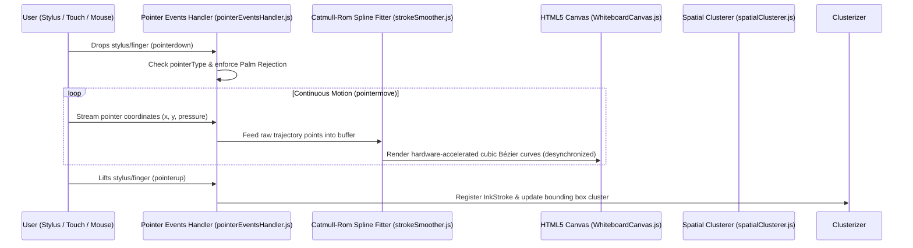
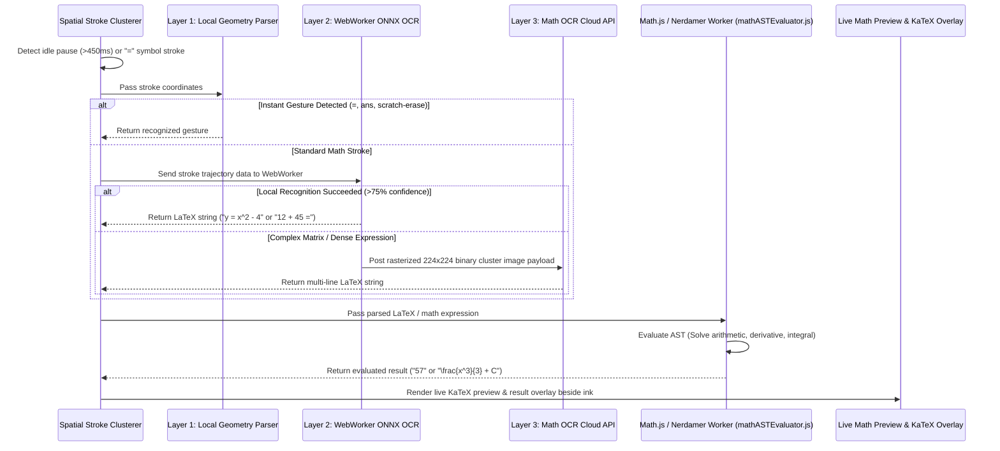

# NETZ Smart Whiteboard & Calculator Playground - Technical Architecture & Master Specification

> **Single Source of Truth (SSOT)**  
> This master document consolidates all architecture specifications, data schemas, algorithmic workflows, equation↔graph mapping mechanics, zero-API-cost optimization strategies, and Apple Math Notes benchmarking into one single document for the **NETZ Smart Whiteboard & Calculator Playground** (`src/app/(Primary.pages)/Playground/page.js`).

---

## 1. Executive Overview & Product Vision

The **NETZ Smart Whiteboard & Calculator Playground** is a **cross-platform, touch-and-stylus-optimized interactive math canvas**. Designed for students, researchers, and engineers across all device form factors — including iPads (Apple Pencil), Android tablets, Windows convertibles/touchscreens, Chromebooks, desktop browsers (mouse & Wacom tablets), and digital smartboards — it bridges freehand intuitive drawing with real-time **Handwriting-to-LaTeX conversion**, **live mathematical expression evaluation**, **bidirectional equation ↔ graph smart mapping**, and **instant transcription into Notion-style typed block notes**.

### Key Architectural Pillars:
1. **100% Browser-Native & Zero API Cost for Core Math**:
   - Handwriting classification, computer algebra system (CAS) operations (differentiation, integration, simplification), expression evaluation, and curve fitting run **locally inside background WebWorkers** using quantized WebWorker ONNX/TF.js models, `Math.js`, and `Nerdamer`.
2. **User-Controlled Ink-to-Text Conversion & Graceful Fallback**:
   - Handwriting recognition (Ink $\rightarrow$ Typed LaTeX/Text) is the #1 priority and works flawlessly on-demand via the floating preview pill or tap.
   - Equation evaluation is **user-triggered and optional** (e.g., tapping `=` or selecting an AI action). For conceptual, structural, or non-evaluable expressions, the engine gracefully notifies *"Conceptual expression / Cannot evaluate numerical value"* without forcing broken answers, preserving clean LaTeX rendering.
3. **Apple Math Notes Parity + Symbolic CAS Superiority**:
   - Matches Apple Math Notes (iPadOS 18) instant handwritten evaluation (`12 + 45 =` $\rightarrow$ `57`) and equation-to-graph generation on demand.
   - Exceeds Apple Math Notes by offering **bidirectional Graph-to-Equation shape fitting** (freehand sketch $\rightarrow$ equation) and **Symbolic Computer Algebra** (derivatives, integrals, matrix operations).
4. **Hardware-Accelerated 60-120 FPS Inking**:
   - Leverages HTML5 Pointer Events API (`desynchronized: true`) with Catmull-Rom spline smoothing and palm rejection to guarantee zero stroke lag on iPads, touchscreens, and graphics tablets.
5. **Smart Block Mapping ("The Clubbing")**:
   - Organizes canvas content into linked **Smart Blocks** (Equation, Graph, Theory, Sketch) connected via dynamic SVG Bézier link paths with reactive auto-updating.

---

## 2. Overall Architecture & Tech Stack

```
                                  [NETZ Playground Master Architecture]
                                                    │
     ┌──────────────────────────────────────────────┼──────────────────────────────────────────────┐
     ▼                                              ▼                                              ▼
[Pointer & Canvas Engine]            [Hybrid 3-Layer OCR Engine]                     [Smart Block Mapping & CAS]
     │                                              │                                              │
 ┌───┴────────────────────────┐         ┌───────────┴───────────┐                      ┌───────────┴───────────┐
 ▼                            ▼         ▼                       ▼                      ▼                       ▼
HTML5 Pointer Events     Catmull-Rom   Layer 1: Gesture Parser  Layer 2: Local ONNX    SmartBlock State Store  Math.js / Nerdamer AST
(Pen, Touch, Mouse)    Spline Smooth   Layer 3: Math OCR API   (Client WebWorker)     (Equation ↔ Graph Link) (WebWorker CAS & Curve Fit)
```

### Core Stack Components:
* **Canvas Rendering Engine**: Dual-layer HTML5 Canvas + SVG overlay for high-frequency vector stroke rendering (60-120 FPS) and smooth block connector rendering.
* **Input Normalization Layer**: HTML5 Pointer Events API (`pointerdown`, `pointermove`, `pointerup`) with device-agnostic input normalization (`pointerType === 'pen' | 'touch' | 'mouse'`), pressure (`e.pressure`), tilt, and hardware palm rejection.
* **Handwriting & Math OCR Pipeline**:
  * **Layer 1 (Local Geometry Parser)**: Sub-20ms gesture detection (`=`, `ans`, circle-select, scratch-out erase).
  * **Layer 2 (Client-Side WebWorker OCR)**: Quantized INT8 ONNX Runtime Web / TensorFlow.js model running locally for zero-latency stroke-to-symbol recognition ($0-9$, $+$, $-$, $\times$, $\div$, $\int$, $\sum$, $\sqrt{\ }$, variables).
  * **Layer 3 (High-Precision Math OCR API Fallback)**: Rasterized canvas payload sent to lightweight Math OCR transformer endpoint (e.g. HuggingFace `TrOCR`/`Nougat` or Gemini Vision API) for complex multi-line matrix calculus.
* **Live CAS Engine**: `Math.js` and `Nerdamer` AST engine running inside WebWorkers for instant expression evaluation and symbolic math without UI main-thread freezing.
* **Equation & Graph Plotter**: Existing `evaluateMath.js` + `Chart.js` (`UnifiedPlot.js`) for reactive graph generation.
* **Math Formula Renderer**: KaTeX (`katex`, `react-katex`) for crisp mathematical rendering.

---

## 3. Data Schemas & Canvas State Model

```typescript
// Pointer Trajectory & Inking Point
export interface PointerPoint {
  x: number;             // X coordinate in canvas space
  y: number;             // Y coordinate in canvas space
  pressure: number;      // Normalised pressure (0.0 to 1.0)
  timestamp: number;     // Performance timestamp (ms)
}

// Vector Ink Stroke Model
export interface InkStroke {
  id: string;            // Unique stroke identifier
  color: string;         // Hex color code (e.g. "#3B82F6")
  width: number;         // Base stroke width (px)
  tool: 'pen' | 'highlighter' | 'eraser';
  points: PointerPoint[];// Captured stroke trajectory points
  bbox: BoundingBox;     // Bounding box { minX, minY, maxX, maxY }
}

export interface BoundingBox {
  minX: number;
  minY: number;
  maxX: number;
  maxY: number;
}

// Bounding Box Stroke Cluster for OCR & Math Solver
export interface StrokeCluster {
  clusterId: string;
  strokeIds: string[];
  bbox: BoundingBox;
  rawTrajectoryData: PointerPoint[][];
  detectedLatex?: string;   // E.g., "\int_0^1 x^2 dx ="
  detectedText?: string;    // E.g., "Velocity of particle"
  evaluatedResult?: string; // E.g., "0.3333" or "\frac{1}{3}"
  status: 'drawing' | 'parsing' | 'evaluated' | 'converted';
}

// Extended Smart Block Entity for Mapped Objects (Equation ↔ Graph ↔ Theory ↔ Sketch)
export interface SmartBlock {
  blockId: string;
  sourceClusterId?: string;       // Associated StrokeCluster ID (if generated from ink)
  type: 'equation' | 'graph' | 'theory' | 'sketch';
  content: {
    latex?: string;               // For equation blocks: "y = x^2 - 4x + 3"
    graphData?: {                 // For graph blocks: Chart.js dataset payload
      labels: number[];
      datasets: any[];
      domainRange: [number, number];
    };
    text?: string;                // For theory blocks: Markdown / rich text
    strokes?: InkStroke[];        // For sketch blocks: isolated drawing strokes
  };
  linkedBlockIds: string[];       // Array of associated block IDs (equation ↔ graph pair)
  position: { x: number; y: number };
  size: { width: number; height: number };
  status: 'active' | 'collapsed' | 'locked';
}

// Reactive Link Path Connector between Smart Blocks
export interface BlockLink {
  linkId: string;
  sourceBlockId: string;
  targetBlockId: string;
  type: 'equation-to-graph' | 'graph-to-equation' | 'manual';
  color: string;
}

// Full Canvas Workspace Session State Schema
export interface PlaygroundCanvasSession {
  sessionId: string;
  title: string;
  createdAt: string;
  updatedAt: string;
  strokes: InkStroke[];
  clusters: StrokeCluster[];
  smartBlocks: SmartBlock[];
  blockLinks: BlockLink[];
  gridStyle: 'none' | 'grid' | 'dots' | 'lines';
  zoomLevel: number;
  panOffset: { x: number; y: number };
}
```

---

## 4. Workflows & Algorithmic Pipelines

### A. Freehand Inking & Catmull-Rom Spline Curve Fitting



### B. Hybrid 3-Layer OCR & Live Math Evaluation Sequence



### C. Smart Equation ↔ Graph Bidirectional Mapping

```
[Handwritten / Typed Equation]  ────────(equationToGraph.js)───────>  [Linked Chart.js GraphBlock]
("y = x^2 - 4x + 3")                                                   (Auto-rendered plot curve)
       ▲                                                                      │
       │                                                                      │
       └───────────────(graphToEquation.js + sketchShapeAnalyzer.js)──────────┘
                  (Least-Squares Matrix Polynomial Regression)
```

1. **Equation $\rightarrow$ Graph Mapping (`equationToGraph.js`)**:
   - Parses the LaTeX string from an `EquationBlock` using `evaluateMath.js`.
   - Generates 200+ continuous $(x, y)$ sample points across an auto-detected domain ($[-10, 10]$).
   - Spawns a linked `GraphBlock` wrapping `UnifiedPlot.js`.
   - Draws a dynamic SVG Bézier link path between the Equation Block and Graph Block (`BlockLinkRenderer.js`).
   - Editing the equation auto-updates the graph curve after a 300ms debounce.

2. **Graph Shape $\rightarrow$ Equation Reverse Extraction (`graphToEquation.js` & `sketchShapeAnalyzer.js`)**:
   - When a user sketches a curve or parabola shape on a `SketchBlock`:
   - `sketchShapeAnalyzer.js` evaluates stroke curvature, direction changes, and symmetry to classify the candidate shape (parabola, linear, trigonometric).
   - `graphToEquation.js` performs **least-squares matrix polynomial regression**:
     $$A = \begin{bmatrix} 1 & x_1 & x_1^2 \\ 1 & x_2 & x_2^2 \\ \vdots & \vdots & \vdots \end{bmatrix}, \quad \mathbf{c} = (A^T A)^{-1} A^T \mathbf{y}$$
   - Generates the best-fit LaTeX equation ($y = 1.2x^2 - 0.5x + 2$) with an $R^2$ confidence score and spawns a linked `EquationBlock`.

### D. Contextual AI Action Button (`AIActionButton.js`)

Floating `✨ AI` trigger on active Smart Blocks providing **100% browser-native Computer Algebra System (CAS)** transforms without API server costs:

| Block Type | Contextual AI Actions | Under the Hood Engine |
| :--- | :--- | :--- |
| **Equation Block** | 📊 Plot Graph, $\frac{d}{dx}$ Differentiate, $\int$ Integrate, Simplify, Find Roots | `evaluateMath.js` + `mathjs.derivative()` + `nerdamer('integrate(...)')` + `nerdamer.solve()` |
| **Graph Block** | 📝 Extract Equation, Find Critical Points (Roots/Extrema), Export SVG/PNG | `graphToEquation.js` + `evaluateMath.js` + `exportEngine.js` |
| **Sketch Block** | 📐 Recognize Shape, Convert to Graph, Convert to LaTeX | `sketchShapeAnalyzer.js` + Layer 2 ONNX OCR |
| **Theory Block** | 🔤 Convert to KaTeX LaTeX, Sync to Notes Workspace | KaTeX parser + `InkToBlockConverterModal.js` |

---

## 5. UI Architecture & Bottom Dock Layout

```
┌───────────────────────────────────────────────────────────────────────────────────────────────────┐
│ NETZ Smart Whiteboard Infinite Canvas (editorial-grid-bg / dots)                                 │
│                                                                                                   │
│   ┌───────────────────────────┐      SVG Bézier Link      ┌───────────────────────────────────┐   │
│   │ EquationBlock [y = x²-4]  │~~~~~~~~~~~~~~~~~~~~~~~~~~~│ GraphBlock (Chart.js / UnifiedPlot)│   │
│   │ [✨ AI Actions]           │                           │ [y = x²-4 plot curve]             │   │
│   └───────────────────────────┘                           └───────────────────────────────────┘   │
│                                                                                                   │
│                                                                                                   │
│  ┌─────────────────────────────────────────────────────────────────────────────────────────────┐  │
│  │ Floating Bottom Dock (PlaygroundDock.js)                                                    │  │
│  │ ✍️ Pen  🖍️ Highlight  🧹 Eraser  │ ➕ Eq  📊 Graph  📝 Theory  ✏️ Sketch │ ↩️ ↪️  🔍 Zoom  📤 Export│  │
│  └─────────────────────────────────────────────────────────────────────────────────────────────┘  │
└───────────────────────────────────────────────────────────────────────────────────────────────────┘
```

### Components Breakdown:
1. **`PlaygroundCanvasContainer.js`**: Top-level wrapper managing viewport pan/zoom matrix, Smart Block state, and global event listeners.
2. **`WhiteboardCanvas.js`**: Low-latency 2D HTML5 canvas for continuous ink stroke rendering with `desynchronized: true`.
3. **`PlaygroundDock.js`**: macOS-style bottom floating dock (`backdrop-filter: blur(16px)`) integrating drawing tools, block creation shortcuts, zoom controls, and export tools in a unified horizontal toolbar.
4. **`SmartBlockWrapper.js`**: Resizable, draggable container for canvas blocks featuring color-coded linked borders and header controls.
5. **`EquationBlock.js`**: Dual-mode equation block (KaTeX rendered math + editable text input + mini ink canvas).
6. **`GraphBlock.js`**: Reactive wrapper around `UnifiedPlot.js` rendering interactive function plots.
7. **`TheoryBlock.js`**: Rich-text notes block with inline KaTeX support ($...$).
8. **`SketchBlock.js`**: Isolated mini-canvas for shape sketching and reverse equation fitting.
9. **`BlockLinkRenderer.js`**: SVG overlay drawing animated Bézier curves between linked blocks.
10. **`AIActionButton.js`**: Floating radial/dropdown action trigger for browser-native CAS operations.
11. **`LiveMathPreviewOverlay.js`**: Floating preview pill attached to handwritten stroke bounding boxes displaying live KaTeX results next to `=`.
12. **`InkToBlockConverterModal.js`**: Converts whiteboard blocks directly into Notion-style blocks inside `src/app/(Primary.pages)/Notes/page.js`.

---

## 6. Directory & File Structure

```
src/app/(Primary.pages)/Playground/
├── page.js                              # Main Playground Entry Point (Lazy dynamic import)
├── components/
│   ├── PlaygroundCanvasContainer.js      # Master Canvas & Viewport State Manager
│   ├── WhiteboardCanvas.js              # Hardware-Accelerated 2D HTML5 Inking Canvas
│   ├── PlaygroundDock.js                # Bottom macOS-Style Floating Dock
│   ├── LiveMathPreviewOverlay.js        # Floating KaTeX Ink Preview Pill
│   ├── CanvasGridBackground.js          # Grid, Dots, Lines Canvas Backdrop
│   ├── InkToBlockConverterModal.js      # Whiteboard -> Notes Workspace Sync Modal
│   ├── AIActionButton.js               # Contextual CAS & AI Transform Button
│   ├── BlockLinkRenderer.js            # SVG Bézier Connector Line Renderer
│   └── blocks/
│       ├── SmartBlockWrapper.js         # Draggable / Resizable Block Frame
│       ├── EquationBlock.js             # KaTeX + Edit + Ink Equation Block
│       ├── GraphBlock.js               # Interactive Chart.js Function Plot Block
│       ├── TheoryBlock.js              # Rich Text / Markdown Theory Block
│       └── SketchBlock.js              # Freeform Shape Sketching Block
└── utils/
    ├── pointerEventsHandler.js          # Unified Pen, Touch & Mouse Input Normalizer
    ├── strokeSmoother.js                # Catmull-Rom Spline Interpolator
    ├── spatialClusterer.js              # Bounding Box Stroke Trajectory Clusterer
    ├── handwritingOCR.js            # Hybrid 3-Layer OCR Pipeline (ONNX/TF.js)
    ├── mathASTEvaluator.js              # WebWorker Math.js & Nerdamer AST Solver
    ├── equationToGraph.js               # AST Math -> Chart.js Plot Dataset Generator
    ├── graphToEquation.js               # Least-Squares Polynomial & Trig Curve Fitter
    ├── sketchShapeAnalyzer.js           # Geometry Stroke Curvature & Shape Classifier
    └── smartBlockStore.js               # useReducer Store for Smart Blocks & Undo/Redo
```

---

## 7. Step-by-Step Implementation Roadmap

### Phase 1: Touch & Pointer Normalization & Low-Latency Canvas
* [ ] Create `pointerEventsHandler.js` to normalize pen, touch, and mouse input with hardware palm rejection.
* [ ] Build `WhiteboardCanvas.js` with `desynchronized: true` canvas context and Catmull-Rom curve fitting (`strokeSmoother.js`).
* [ ] Build `PlaygroundDock.js` with drawing tool controls, color picker, and stroke width slider.

### Phase 2: Spatial Clustering & Hybrid OCR Engine
* [ ] Build `spatialClusterer.js` to group strokes into bounding boxes based on spatial proximity and time gaps (>450ms).
* [ ] Integrate Layer 1 geometry parser (`=`, `ans`, scratch-erase gestures).
* [ ] Build `handwritingOCR.js` with WebWorker quantized ONNX/TF.js local stroke recognition.

### Phase 3: Smart Block System & Equation ↔ Graph Mapping
* [ ] Build `smartBlockStore.js` (`useReducer` state management with 50-step undo/redo stack and auto-save to `localStorage`).
* [ ] Implement `SmartBlockWrapper.js`, `EquationBlock.js`, `GraphBlock.js`, `TheoryBlock.js`, and `SketchBlock.js`.
* [ ] Build `equationToGraph.js` (equation string $\rightarrow$ `UnifiedPlot` dataset).
* [ ] Build `graphToEquation.js` and `sketchShapeAnalyzer.js` (least-squares curve fitting).
* [ ] Build `BlockLinkRenderer.js` for SVG Bézier connector lines.

### Phase 4: Live Math Solver & Contextual CAS AI Actions
* [ ] Integrate WebWorker `mathASTEvaluator.js` (`Math.js` + `Nerdamer`) for automatic evaluation of expressions ending in `=`.
* [ ] Build `LiveMathPreviewOverlay.js` displaying live KaTeX results next to handwritten strokes.
* [ ] Implement `AIActionButton.js` for browser-native symbolic differentiation, integration, simplification, and root finding.

### Phase 5: Workspace Sync & Vector Export
* [ ] Build `InkToBlockConverterModal.js` to convert whiteboard blocks into Notion-style blocks inside `src/app/(Primary.pages)/Notes/page.js`.
* [ ] Connect SVG and PDF vector export via `exportEngine.js`.

---

## 8. Apple Math Notes Performance & Optimization Guidelines

To guarantee **Apple-grade responsiveness** (sub-16ms frame times, sub-250ms recognition, zero API server cost), the implementation enforces these non-negotiable guidelines:

1. **Non-Blocking Pointer Event Loop**:
   - Never call React `setState` during active `pointermove` drag events.
   - Buffer points in a `useRef` array, draw directly to canvas context, and commit to React state only on `pointerup`.
2. **Unbuffered 2D Context**:
   - Initialize HTML5 canvas with `canvas.getContext('2d', { desynchronized: true, alpha: false })` to bypass OS compositor delay on supported browsers.
3. **AST Expression Cache**:
   - Leverage `compileCache` in `evaluateMath.js` so math expressions are compiled to AST once and evaluated in sub-1ms execution time.
4. **Debounced Graph Rendering**:
   - Debounce reactive graph updates by 300ms when editing an equation to avoid thrashing Chart.js canvas redraws.
5. **Virtual Viewport Rendering**:
   - For large whiteboard sessions with 50+ blocks, render only Smart Blocks and link connectors within the active viewport bounds `(panOffset, zoomLevel)`.
